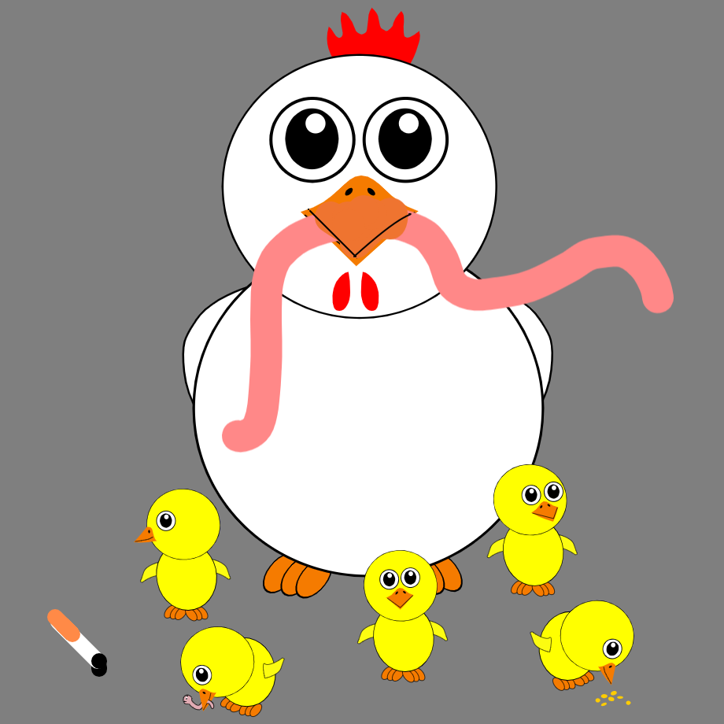
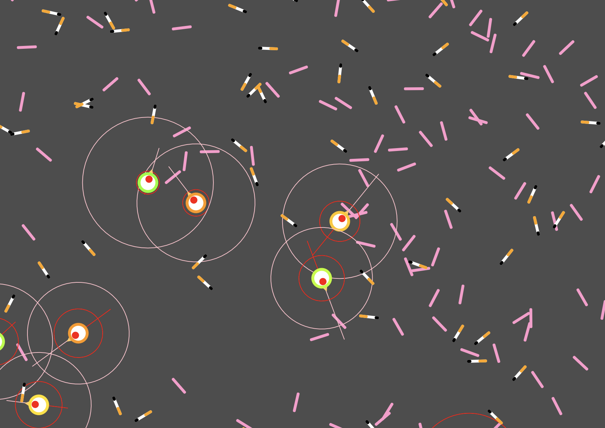

### Chicken, Worms and Cigarette Butts 🐔🐛🚬

Evolutionary steering behaviors implemented in JavaScript using p5.js.
The system where autonomous steering agents (Chickens) evolve the behavior of eating food (Worms) and avoiding poison (Cigarette Butts).

Initial population of chickens are born with a set of random genes that determines the vision range and attraction to the worms and cigarette butts.
Each chicken is born with 100% health. Every time chicken eats a worm the health increases. Every time chicken eats a cigarette butt the health drops.
If a chicken is lucky enought to reach 150% of health, it will reproduce. The offspring will inherit the DNA of the parent but with a slight mutation. The parent's health will drop to 50% after giving birth. 

Inspired by Coding Challenge #69: Evolutionary Steering Behaviors  of [Daniel Shiffman ("The Coding Train")](https://www.youtube.com/watch?v=flxOkx0yLrY&t=417s "The Coding Train")

